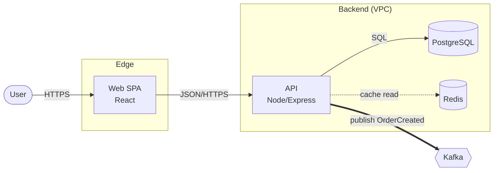
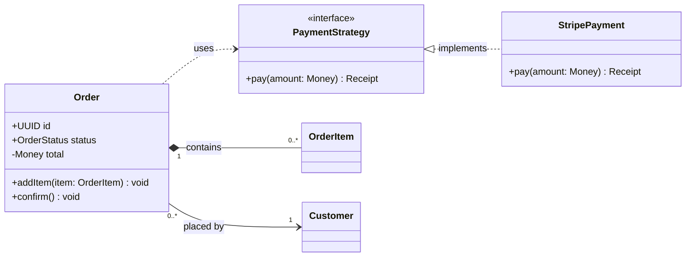
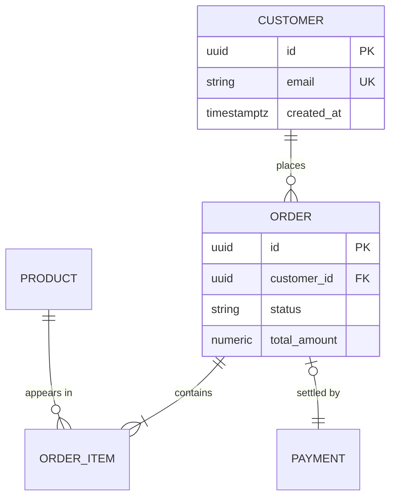
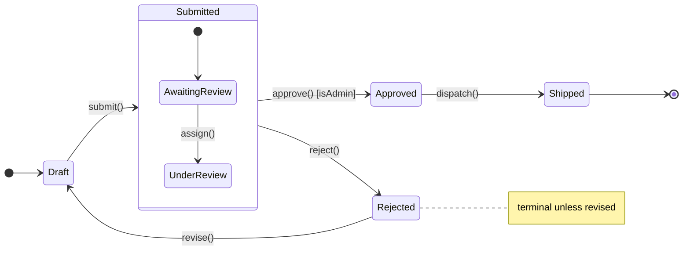
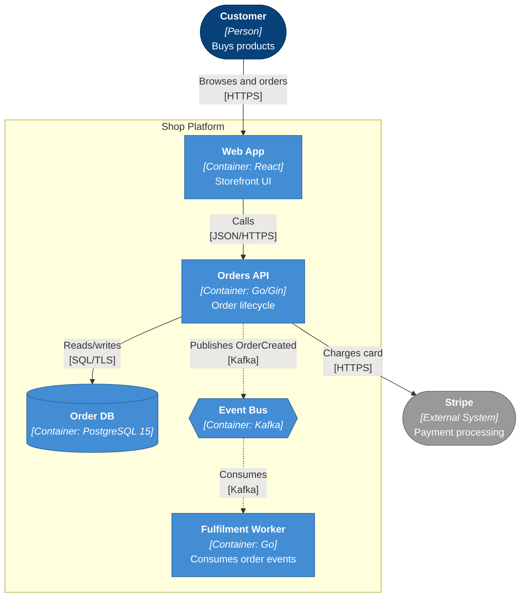
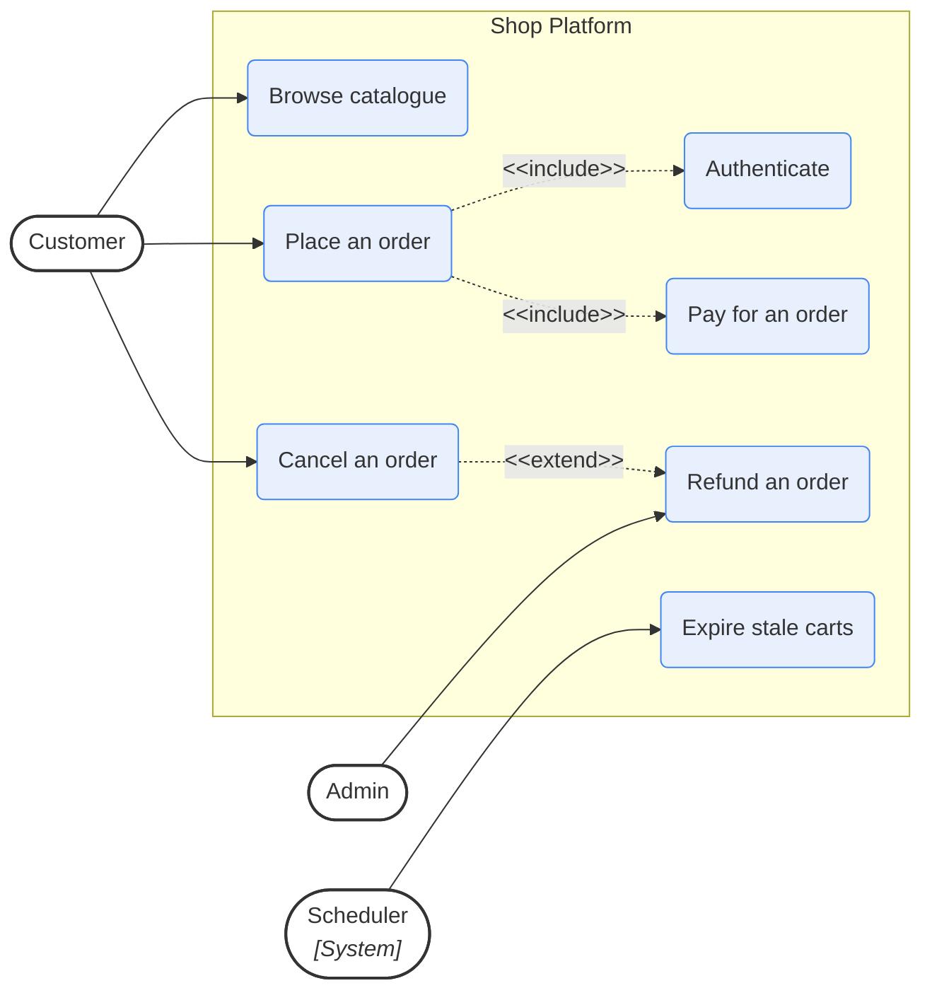
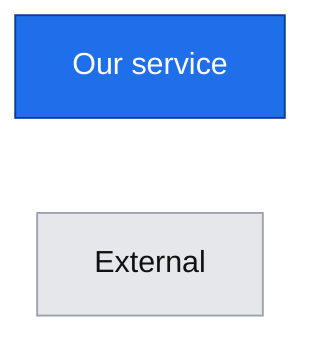
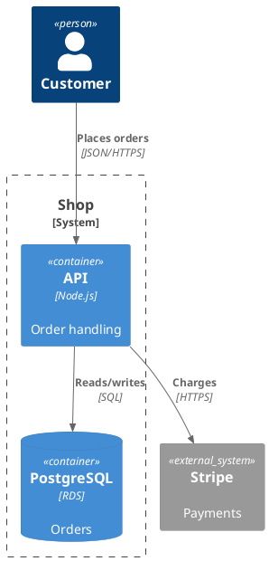
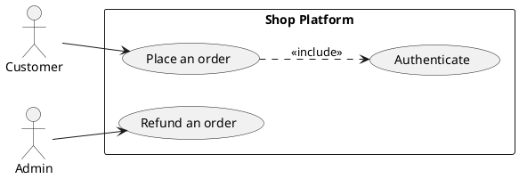

# Notation

Templates that render, plus the things that break the parser.

## Contents
- [Parser traps (read first)](#parser-traps-read-first)
- [Flowchart](#flowchart)
- [Sequence](#sequence)
- [Class](#class)
- [ER](#er)
- [State](#state)
- [C4 template](#c4-template)
- [Use case template](#use-case-template)
- [Styling](#styling)
- [PlantUML](#plantuml)

## Parser traps (read first)

These cause the large majority of render failures.

1. **Quote any label containing** `(` `)` `[` `]` `{` `}` `,` `:` `#` `"` **or** `-`.
   `A[getUser(id)]` fails → `A["getUser(id)"]`. Edge labels too:
   `A -->|"HTTP (443)"| B`.
2. **`end` is reserved.** A node id or bare label `end` breaks flowcharts. Use `End`,
   `finish`, or `A["end"]`.
3. **Node ids starting with `o` or `x` right after an edge** get eaten as edge
   decorations: `A---oOrders` parses as a circle-edge. Add a space or capitalise.
4. **Ids are simple**: letters, digits, `_`. No spaces, dots or dashes. Pretty name
   goes in the label: `order_svc["Order Service"]`.
5. **Line breaks are `<br/>`**, not `\n`.
6. **Comments are `%%` at line start.** Mid-line `%%` is unreliable.
7. **Don't name nodes** `graph`, `subgraph`, `class`, `click`, `style`, `default`,
   `state`, `flowchart`.
8. **Use `flowchart` not `graph`**, and `stateDiagram-v2` not `stateDiagram`.
9. **`C4Context` is experimental** — poor layout, shifting syntax. Use the flowchart
   C4 template below.
10. **Subgraph nesting ≤2 deep.** Deeper produces tangled edges.
11. **No `style` directives inside `sequenceDiagram`** — Mermaid doesn't support them
    there. Style sequence diagrams with `rect rgb(...)` blocks or themes only.
12. `direction` inside a subgraph works only in flowcharts, and is ignored in some
    versions when an edge crosses the boundary. Use it for cosmetics, never rely on it.

## Flowchart



Shapes: `["rect"]` process/component · `("rounded")` actor/external ·
`([stadium])` start/end · `[("cylinder")]` datastore · `{{hexagon}}` broker/queue ·
`{"diamond"}` decision · `[["subroutine"]]` module.

Edges: `-->` solid · `-.->` dotted (async/optional) · `==>` thick (primary path) ·
`---` plain · `--x` cross end.

`LR` for pipelines and layered architectures; `TB` for hierarchies and decisions.

## Sequence

```mermaid
sequenceDiagram
  autonumber
  actor U as Customer
  participant API as CheckoutController
  participant SVC as OrderService
  participant PAY as StripeClient
  participant DB as PostgreSQL
  participant MQ as Kafka

  U->>API: POST /checkout
  activate API
  API->>SVC: createOrder(dto)
  activate SVC

  SVC->>DB: BEGIN; INSERT orders
  DB-->>SVC: order_id

  alt payment authorised
    SVC->>PAY: charge(amount)
    PAY-->>SVC: 200 charge_id
    SVC->>DB: COMMIT
    SVC-)MQ: publish OrderCreated
    Note right of MQ: async — no ack awaited
  else declined
    SVC->>DB: ROLLBACK
    SVC-->>API: PaymentDeclinedError
  end

  SVC-->>API: Order
  deactivate SVC
  API-->>U: 201 Created
  deactivate API
```

Arrows — this distinction matters more than any other detail:

| Syntax | Meaning |
|---|---|
| `->>` | synchronous call, response expected |
| `-->>` | return / response (dashed) |
| `-)` | **async** send, no wait — events, queue publish, fire-and-forget |
| `--)` | async return / callback |
| `-x` | terminated / failed call |

Fragments: `alt/else`, `opt`, `loop`, `par/and`, `critical/option`, `break`, `rect`.
Activation: `activate`/`deactivate`, or `+`/`-` shorthand (`API->>+SVC: call`).

## Class



Relationships — the arrowhead points at the **parent/target**, a frequent error:

| Syntax | Meaning |
|---|---|
| `Parent <\|-- Child` | inheritance |
| `Interface <\|.. Impl` | realization |
| `Whole *-- Part` | composition (part dies with whole) |
| `Whole o-- Part` | aggregation (part survives) |
| `A --> B` | association |
| `A ..> B` | dependency |

Visibility `+ - # ~`. Annotations `<<interface>>`, `<<abstract>>`, `<<enumeration>>`.

## ER



Cardinality, read the side nearest the entity:

| Symbol | Meaning |
|---|---|
| `\|o` / `o\|` | zero or one |
| `\|\|` | exactly one |
| `}o` / `o{` | zero or more |
| `}\|` / `\|{` | one or more |

`--` identifying, `..` non-identifying.

## State



## C4 template

Proper C4 semantics on a stable renderer.



Element format at every level: **name**, `[type: technology]`, one-line
responsibility. The responsibility line is what makes C4 useful — without it you have
boxes and lines.

### Polished high-level architecture profile

For generic high-level architecture, keep the evidence-backed C4-style nodes but use
the `polished-overview` presentation contract in
`high-level-architecture-style.md`.

A minimal styling skeleton:

```mermaid
flowchart TB
  classDef clients fill:#EAF3FF,stroke:#2F80ED,color:#172033,stroke-width:1.5px
  classDef ingress fill:#EAF3FF,stroke:#2F80ED,color:#172033,stroke-width:1.5px
  classDef api fill:#F5F0FF,stroke:#8B5CF6,color:#172033,stroke-width:1.5px
  classDef realtime fill:#FFF1F2,stroke:#F87171,color:#172033,stroke-width:1.5px
  classDef messaging fill:#FFF7E6,stroke:#F59E0B,color:#172033,stroke-width:1.5px
  classDef processing fill:#EFF6FF,stroke:#3B82F6,color:#172033,stroke-width:1.5px
  classDef observability fill:#ECFDF9,stroke:#14B8A6,color:#172033,stroke-width:1.5px
  classDef data fill:#F8FAFC,stroke:#64748B,color:#172033,stroke-width:1.5px
  classDef external fill:#FFF5F5,stroke:#EF4444,color:#172033,stroke-width:1.5px

  clients_node["<b>Clients</b><br/>mobile · dashboard"]:::clients

  subgraph runtime["Backend · runtime boundary"]
    ingress_node["<b>nginx</b><br/>ingress"]:::ingress
    api_node["<b>api-gateway</b><br/>REST API + RMQ clients"]:::api

    subgraph realtime_group["Realtime communication"]
      conversation["conversation-service"]:::realtime
      call["call-service"]:::realtime
      notification["notification-service"]:::realtime
    end

    broker{{"<b>rabbitmq</b><br/>AMQP broker"}}:::messaging
  end

  data_node[("<b>Service data layer</b>")]:::data
  external_node(["<b>External integrations</b>"]):::external

  clients_node -->|"HTTPS / WSS"| ingress_node
  ingress_node -->|"REST"| api_node
  ingress_node -->|"Socket.IO"| conversation
  ingress_node -->|"Call Socket.IO"| call
  api_node -.->|"RMQ"| broker
  call -.->|"call events"| broker
  notification -->|"push"| external_node
  conversation -->|"persists"| data_node
```

Important: `realtime_group` is presentation-only. No edge terminates on it; edges
terminate on `conversation`, `call` and `notification`.

Use `<br/>`, never `\n`. Keep labels short enough that peer nodes stay visually
balanced.

## Use case template

Mermaid has no native use-case notation. Draw it as a flowchart, actors left, system
boundary as a subgraph:



Note the HTML-escaped guillemets — raw `<<include>>` in an edge label can break the
parser. If the user wants textbook UML notation with stick figures and ellipses, use
PlantUML instead.

## Styling



Use colour only to encode meaning — internal vs external, sync vs async, new vs
existing — and always add a legend line in the prose. Decorative colour makes diagrams
harder to read.

## PlantUML

Use when the user asks, when they want true C4-PlantUML, when they need UML use-case
notation, or for very large diagrams needing a stronger layout engine.



Use case in PlantUML, which does have the notation:



Render with `plantuml -tsvg file.puml` (needs Java + Graphviz). Note in the delivery
that PlantUML doesn't render natively on GitHub, so it needs a render step or a
committed SVG.
